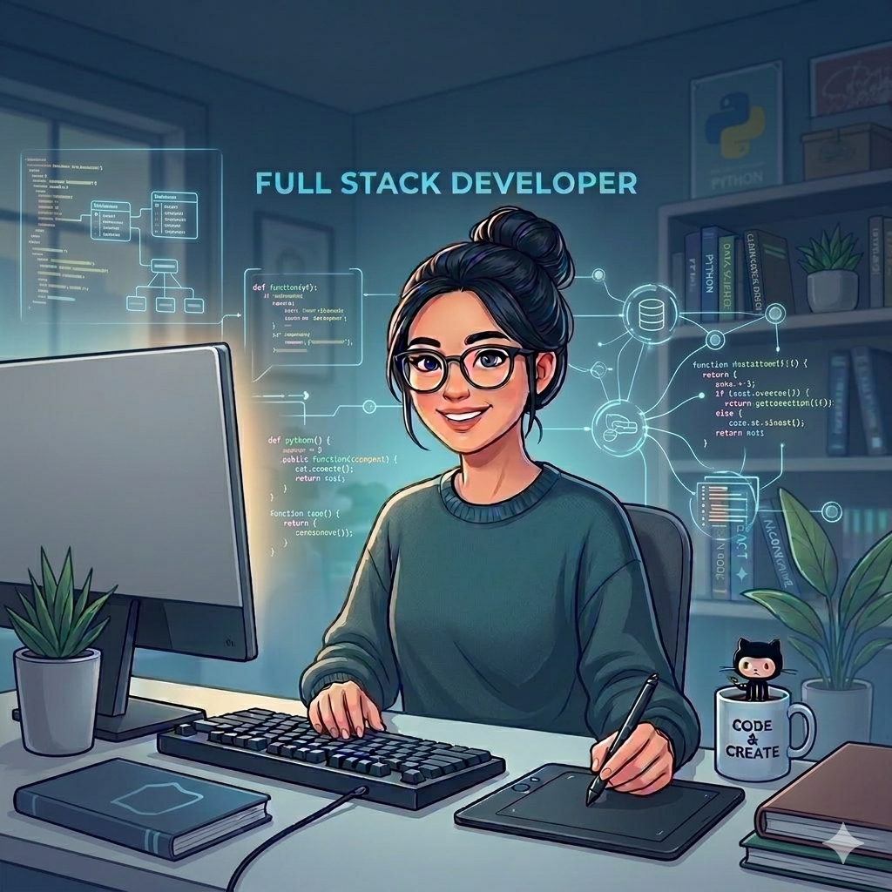

# ¡Hi World! Soy Evelyn 👋

### Full Stack Developer en formación 💻

Me apasiona el mundo de la programación y crear soluciones creativas a través del código. Actualmente estoy enfocada en fortalecer mis habilidades en el desarrollo de software y gestión de datos.

---

### 🛠️ Tecnologías que utilizo:
- **Lenguajes:** Python, html
- **Herramientas:** Git, GitHub, JSON, Scrum
- **Enfoque:** Código limpio y arquitectura modular

---

### 🎯 Mis Objetivos:
- [ ] Dominar el idioma Inglés.
- [ ] Desarrollar proyectos de impacto con Python.
- [ ] Seguir aprendiendo nuevas tecnologías cada día.

---

### 📫 Conéctate conmigo:
**Discord:** @evelynbarrios__34066
