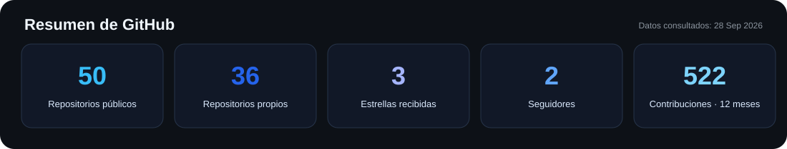
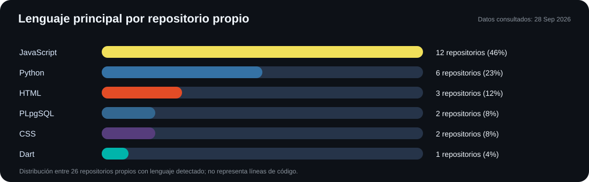
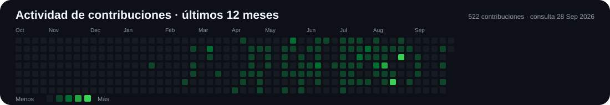

  

  
  
  
  

  <strong>Programación · Desarrollo de software · Facilitación de equipos</strong> 
  Guatemala

---

##  Sobre mí

Soy estudiante de programación y desarrollo de software en Campusland TEC Zona 4. Tengo una base en desarrollo frontend y backend, programación, bases de datos y consumo de APIs. También he coordinado equipos académicos con metodologías ágiles.

Mi experiencia previa en ventas y atención al cliente fortaleció mi comunicación, organización y capacidad para resolver problemas. Busco una oportunidad junior donde pueda contribuir, aprender y crecer junto a un equipo de desarrollo.

## Tecnologías y herramientas

  <strong>Lenguajes y desarrollo</strong> 
  
  
  
  
  

  <strong>Bases de datos</strong> 
  
  

  <strong>APIs, colaboración y gestión</strong> 
  
  
  
  
  
  

**También:** JSON, consumo de APIs, Bruno, Scrum, Kanban, Suite de Microsoft Canva, Meta Business Suite y CRM Kommo.
**Aprendiendo actualmente:** JavaScript con Node.js y programación orientada a objetos (POO).

**Próximamente:** Express.js y MongoDB.

  
  
  
  

## Proyectos destacados

| Proyecto | Aporte y objetivo | Tecnologías | Enlace |
|---|---|---|---|
| **Proyecto para la OMS** | Liderazgo de equipo y desarrollo backend para un proyecto real. Diseño de APIs personalizadas, pruebas y documentación de endpoints, y manejo de tablas de datos. | Strapi, Postman | — |
| **Proyecto Alba** | Liderazgo del equipo que inició una aplicación tecnológica para apoyar la salud de las personas adultas mayores en Guatemala. | Flutter, Firebase | — |
| **Campus Parking** | Aplicación web para gestionar entradas y salidas de vehículos, calcular tarifas por tiempo y administrar categorías de vehículos. | JavaScript, HTML, CSS, localStorage | [Ver proyecto](https://barriosevelyn488-web.github.io/campus_parking_proyecto/DOCSHTML/login.html) |
| **Campus Shop** | Interfaz para una tienda virtual de ropa, con enfoque en experiencia de usuario y estructura clara. | HTML, CSS | [Ver proyecto](https://barriosevelyn488-web.github.io/tienda_campus_shop/) |
| **TutorBot para Telegram** | Chatbot automatizado realizado como proyecto colaborativo. | n8n, Telegram | [Ver repositorio](https://github.com/barriosevelyn488-web/Proyecto_TutorBot_evelyn-barrios_Carlos-Velasco) |

## 🧭 Liderazgo y habilidades

- Facilitación de un equipo de cinco personas bajo Scrum.
- Organización de módulos de trabajo, coordinación de tareas y seguimiento de entregables.
- Comunicación, escucha activa y colaboración.
- Resolución de problemas, adaptabilidad y orientación al logro.
- Uso de herramientas de IA para apoyar el desarrollo y la productividad.

## 🎓 Formación

- **Carrera Técnica en Programación** — Campusland TEC Zona 4, en curso (2026).
- **Administración de Empresas** — Universidad de San Carlos de Guatemala, estudios realizados (2024).
- **Perito Contador con Orientación en Computación** — Instituto Diversificado por Cooperativa PVH, graduada (2022).

## 💼 Experiencia laboral

**Asistente de Ventas Virtual — COSMOS PRODUCTOS** · 2024–2025
Atención a clientes por WhatsApp y llamadas, gestión de guías de envío, creación de contenido digital y seguimiento de métricas de Facebook.

**Asistente de Ventas Presencial — Zona Piel S.A.** · 2022–2024
Atención directa a clientes, organización de bodega y gestión de sala de ventas.

## 📈 GitHub

  
  

  

  

  

  

---

  <a href="https://barriosevelyn488-web.github.io/portafoliohtml/">Visita mi portafolio</a> ·
  <a href="mailto:barrios.evelyn.488@gmail.com">Contáctame</a>

